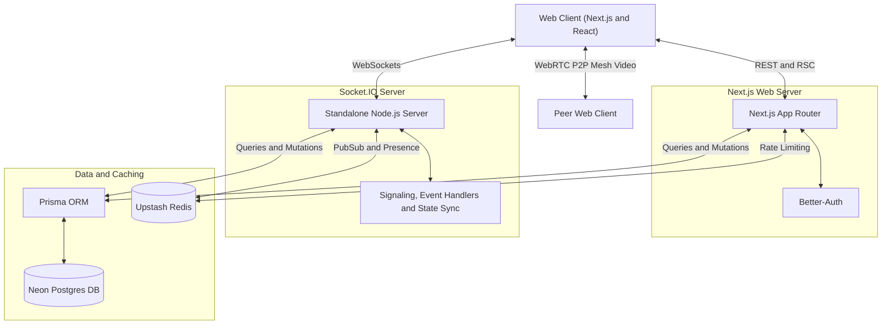

<div align="center">
  <!-- TODO: Replace with your actual logo if you have one -->
  <!--  -->
  
  <h1>Curtus</h1>
  <p><strong>A polished, web-based collaborative focus and study environment.</strong></p>

  <p>
    <a href="https://github.com/yourusername/ss-provider/blob/main/LICENSE"></a>
    <a href="https://nextjs.org/"></a>
    <a href="https://www.typescriptlang.org/"></a>
  </p>
</div>

<br />


<br />

## About

Curtus is a web-based platform designed to facilitate focused study and accountability. Made with a calm and polished user interface, it provides shared virtual spaces where users can work collaboratively in real-time.

Whether you're studying for exams or just need a quiet place to get work done alongside others, Curtus helps you stay on track without getting distracted.

---

## Screenshots


<div align="center">
  

</div>
<br />
<div align="center">  


</div>

---

## Features

- **Study Rooms**: Join open community rooms or create private, invite-only rooms for you and your friends.
- **WebRTC Video & Chat**: Peer-to-peer WebRTC mesh architecture for ultra-low latency video streaming, keeping you visually accountable alongside real-time text chat.
- **Focus Timer**: Built-in study timers to track your deep work sessions automatically.
- **Global Leaderboards**: Track your total study duration, maintain daily streaks, and view global rankings.
- **Task & D-Day Tracking**: Organize daily to-dos and set countdowns for upcoming deadlines or exams.
- **White Noise Library**: Built-in ambient audio to help you stay focused.
- **YouTube Picture-in-Picture**: Watch lectures or ambient streams directly in the app without switching tabs.
- **Configurable Environment**: Modify UI themes, timers, sound cues, and privacy controls to fit your workflow.

---

## Architecture

Curtus uses a decoupled architecture. The frontend handles standard requests and UI state, while a standalone Node.js server acts as the WebRTC signaling layer and real-time state synchronizer. Video feeds are established via direct peer-to-peer connections to minimize server bandwidth.



---

## Tech Stack

- **Frontend Application**: [Next.js 16](https://nextjs.org/) (App Router), React 19
- **Video Streaming Layer**: WebRTC (P2P Mesh Network)
- **Styling & Components**: [Tailwind CSS v4](https://tailwindcss.com/), Radix UI, Shadcn
- **Animation**: [Framer Motion](https://www.framer.com/motion/), [GSAP](https://gsap.com/)
- **Database Layer**: [Neon Postgres](https://neon.tech/), [Prisma v7 ORM](https://www.prisma.io/)
- **Real-time Server**: [Socket.IO](https://socket.io/) (Node.js) for WebRTC signaling and data sync
- **Caching & Rate Limiting**: [Upstash Redis](https://upstash.com/), RateLimit, QStash
- **Observability**: OpenTelemetry, Prometheus, Grafana Cloud (Tempo)

---

## Known Limitations

- **Video Capacity Restrictions**: Video calls utilize a peer-to-peer (P2P) WebRTC mesh network architecture. Because each participant must send and receive streams to every other participant, bandwidth and CPU usage scale exponentially. Therefore, video streams are limited to a maximum of 4 concurrent users per room to maintain performance and client stability.
- **Microphones Intentionally Disabled**: To strictly preserve the quiet, distraction-free "study library" atmosphere, audio transmission (microphones) is permanently disabled. Communication is strictly limited to text chat and visual accountability.

---

## Getting Started

Follow these instructions to set up the project locally for development.

### Prerequisites

- **Node.js**: `v20.x`
- **Package Manager**: npm
- **Postgres Database**: Local instance or hosted (e.g., Neon)
- **Redis**: Local instance or hosted (e.g., Upstash)

### 1. Installation

Clone the repository and install dependencies for both the Next.js application and the Socket.IO server:

```bash
# Install Next.js dependencies
npm ci

# Install socket server dependencies
npm ci --prefix server
```

### 2. Environment Configuration

Copy the example environment file:

```bash
cp .env.example .env
```

**Required configuration:**
- `DATABASE_URL` / `PRISMA_DATABASE_URL`: Postgres connection string.
- `BETTER_AUTH_URL` / `BETTER_AUTH_SECRET`: Authentication credentials.
- `UPSTASH_REDIS_URL` / `UPSTASH_REDIS_TOKEN`: Redis connection parameters.
- `NEXT_PUBLIC_APP_URL` / `NEXT_PUBLIC_SOCKET_URL`: Public URIs for the frontend and socket server.

*(Note: OAuth keys such as `GOOGLE_CLIENT_ID` are optional but required for social login).*

### 3. Database Initialization

Generate the Prisma client and optionally seed the database:

```bash
# Generate Prisma client
npx prisma generate

# Seed initial data
npm run db:seed
```

### 4. Running Development Servers

Curtus requires both the Next.js web server and the Socket.IO server to run concurrently.

**Terminal 1 (Next.js Application):**
```bash
npm run dev
```

**Terminal 2 (Socket.IO Server):**
```bash
npm run dev --prefix server
```

The application will be accessible at `http://localhost:3000`.

---

## Available Scripts

- `npm run dev` — Start the Next.js application in development mode.
- `npm run build` — Create a production build of the Next.js application.
- `npm start` — Run the compiled Next.js application.
- `npm run check` — Execute ESLint and TypeScript type checking.
- `npm test` — Run Vitest unit and integration tests.
- `npm run format` — Format the codebase using Prettier.

---

## Observability

This repository implements a robust observability pipeline:

- **Structured JSON Logs**: Unified logging across web and socket servers with correlation parameters (`request_id`, `trace_id`, `room_id`).
- **Distributed Tracing**: OpenTelemetry traces exported to Grafana Cloud Tempo.
- **Metrics**: Socket server exposes a Prometheus metrics endpoint via `GET /metrics`.

Refer to `docs/observability.md` and `docs/observability-runbook.md` for complete setup instructions.

---

## Contributing

Contributions are welcome. Please refer to our [Contribution Guidelines](CONTRIBUTING.md) to understand our workflow and expectations before submitting a pull request.

---

## Credits & Acknowledgements

A massive thank you to the **[Yeolpumta (YPT)](https://www.yeolpumta.com/en/)** app. I used YPT extensively during my high school exam days, and it served as a core inspiration for this app.

---

## License

Curtus is licensed under the **AGPL-3.0 License**.

> **Important**: If you run a modified version of this software as a network service, the AGPL generally requires you to make the corresponding source code available to users of that service. Make sure you understand your obligations before deploying a modified build. See the [`LICENSE`](LICENSE) file for more details.
---

Built with ❣️ by @dextertwts/amaan
